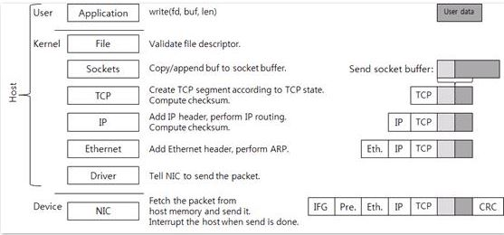
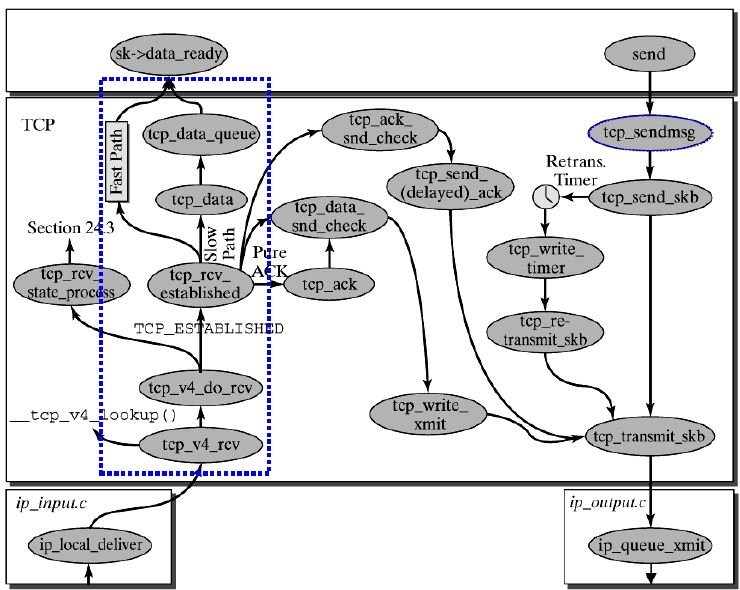
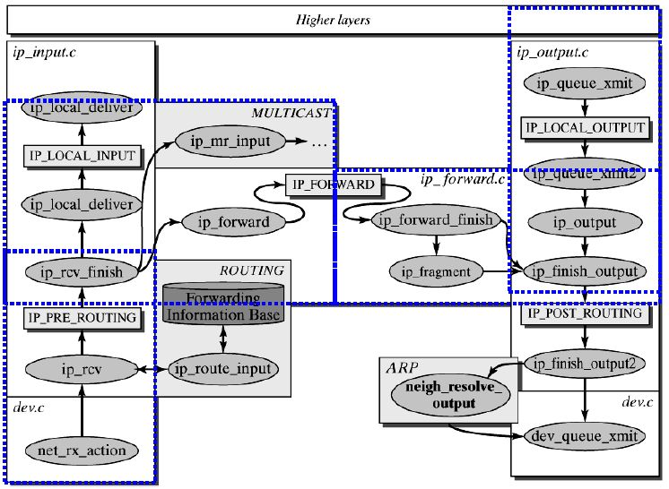
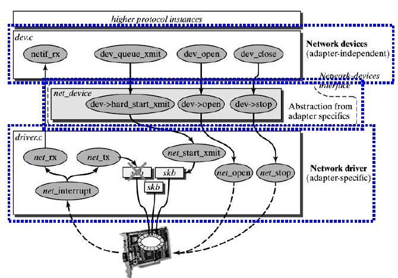

# 2.3 linux网络数据路径

> 本文主要参考自[wuyangchun](https://segmentfault.com/a/1190000008836467)

linux完整的网络路径如下图所示：


## 数据包接收过程

本文将介绍在Linux系统中，数据包是如何一步一步从网卡传到进程手中的。

> 如果英文没有问题，强烈建议阅读后面参考里的两篇文章，里面介绍的更详细。

本文只讨论以太网的物理网卡，不涉及虚拟设备，并且以一个UDP包的接收过程作为示例.

> 本示例里列出的函数调用关系来自于kernel 3.13.0，如果你的内核不是这个版本，函数名称和相关路径可能不一样，但背后的原理应该是一样的（或者有细微差别）

### 网卡到内存

网卡需要有驱动才能工作，驱动是加载到内核中的模块，负责衔接网卡和内核的网络模块，驱动在加载的时候将自己注册进网络模块，当相应的网卡收到数据包时，网络模块会调用相应的驱动程序处理数据。

下图展示了数据包（packet）如何进入内存，并被内核的网络模块开始处理：
```
                   +-----+
                   |     |                            Memroy
+--------+   1     |     |  2  DMA     +--------+--------+--------+--------+
| Packet |-------->| NIC |------------>| Packet | Packet | Packet | ...... |
+--------+         |     |             +--------+--------+--------+--------+
                   |     |<--------+
                   +-----+         |
                      |            +---------------+
                      |                            |
                    3 | Raise IRQ                  | Disable IRQ
                      |                          5 |
                      |                            |
                      ↓                            |
                   +-----+                   +------------+
                   |     |  Run IRQ handler  |            |
                   | CPU |------------------>| NIC Driver |
                   |     |       4           |            |
                   +-----+                   +------------+
                                                   |
                                                6  | Raise soft IRQ
                                                   |
                                                   ↓
```
1. 数据包从外面的网络进入物理网卡。如果目的地址不是该网卡，且该网卡没有开启混杂模式，该包会被网卡丢弃。

2. 网卡将数据包通过DMA的方式写入到指定的内存地址，该地址由网卡驱动分配并初始化。注： 老的网卡可能不支持DMA，不过新的网卡一般都支持。

3. 网卡通过硬件中断（IRQ）通知CPU，告诉它有数据来了。

4. CPU根据中断表，调用已经注册的中断函数，这个中断函数会调到驱动程序（NIC Driver）中相应的函数。

5. 驱动先禁用网卡的中断，表示驱动程序已经知道内存中有数据了，告诉网卡下次再收到数据包直接写内存就可以了，不要再通知CPU了，这样可以提高效率，避免CPU不停的被中断。

6. 启动软中断。这步结束后，硬件中断处理函数就结束返回了。由于硬中断处理程序执行的过程中不能被中断，所以如果它执行时间过长，会导致CPU没法响应其它硬件的中断，于是内核引入软中断，这样可以将硬中断处理函数中耗时的部分移到软中断处理函数里面来慢慢处理。

### 内核的网络模块

软中断会触发内核网络模块中的软中断处理函数，后续流程如下:
```

                                                     +-----+
                                             17      |     |
                                        +----------->| NIC |
                                        |            |     |
                                        |Enable IRQ  +-----+
                                        |
                                        |
                                  +------------+                                      Memroy
                                  |            |        Read           +--------+--------+--------+--------+
                 +--------------->| NIC Driver |<--------------------- | Packet | Packet | Packet | ...... |
                 |                |            |          9            +--------+--------+--------+--------+
                 |                +------------+
                 |                      |    |        skb
            Poll | 8      Raise softIRQ | 6  +-----------------+
                 |                      |             10       |
                 |                      ↓                      ↓
         +---------------+  Call  +-----------+        +------------------+        +--------------------+  12  +---------------------+
         | net_rx_action |<-------| ksoftirqd |        | napi_gro_receive |------->| enqueue_to_backlog |----->| CPU input_pkt_queue |
         +---------------+   7    +-----------+        +------------------+   11   +--------------------+      +---------------------+
                                                               |                                                      | 13
                                                            14 |        + - - - - - - - - - - - - - - - - - - - - - - +
                                                               ↓        ↓
                                                    +--------------------------+    15      +------------------------+
                                                    | __netif_receive_skb_core |----------->| packet taps(AF_PACKET) |
                                                    +--------------------------+            +------------------------+
                                                               |
                                                               | 16
                                                               ↓
                                                      +-----------------+
                                                      | protocol layers |
                                                      +-----------------+
```

7. 内核中的ksoftirqd进程专门负责软中断的处理，当它收到软中断后，就会调用相应软中断所对应的处理函数，对于上面第6步中是网卡驱动模块抛出的软中断，ksoftirqd会调用网络模块的net_rx_action函数。

8. net_rx_action调用网卡驱动里的poll函数来一个一个的处理数据包。

9. 在poll函数中，驱动会一个接一个的读取网卡写到内存中的数据包，内存中数据包的格式只有驱动知道

10. 驱动程序将内存中的数据包转换成内核网络模块能识别的skb格式，然后调用napi_gro_receive函数

11. napi_gro_receive会处理GRO相关的内容，也就是将可以合并的数据包进行合并，这样就只需要调用一次协议栈。然后判断是否开启了RPS，如果开启了，将会调用enqueue_to_backlog

12. 在enqueue_to_backlog函数中，会将数据包放入CPU的softnet_data结构体的input_pkt_queue中，然后返回，如果input_pkt_queue满了的话，该数据包将会被丢弃，queue的大小可以通过net.core.netdev_max_backlog来配置

13. CPU会接着在自己的软中断上下文中处理自己input_pkt_queue里的网络数据（调用__netif_receive_skb_core）

14. 如果没开启RPS，napi_gro_receive会直接调用__netif_receive_skb_core

15. 看是不是有AF_PACKET类型的socket（也就是我们常说的原始套接字），如果有的话，拷贝一份数据给它。tcpdump抓包就是抓的这里的包。

16. 调用协议栈相应的函数，将数据包交给协议栈处理。

17. 待内存中的所有数据包被处理完成后（即poll函数执行完成），启用网卡的硬中断，这样下次网卡再收到数据的时候就会通知CPU

enqueue_to_backlog函数也会被netif_rx函数调用，而netif_rx正是lo设备发送数据包时调用的函数

### 协议栈

#### IP层

由于是UDP包，所以第一步会进入IP层，然后一级一级的函数往下调：
```
          |
          |
          ↓         promiscuous mode &&
      +--------+    PACKET_OTHERHOST (set by driver)   +-----------------+
      | ip_rcv |-------------------------------------->| drop this packet|
      +--------+                                       +-----------------+
          |
          |
          ↓
+---------------------+
| NF_INET_PRE_ROUTING |
+---------------------+
          |
          |
          ↓
      +---------+
      |         | enabled ip forword  +------------+        +----------------+
      | routing |-------------------->| ip_forward |------->| NF_INET_FOWARD |
      |         |                     +------------+        +----------------+
      +---------+                                                   |
          |                                                         |
          | destination IP is local                                 ↓
          ↓                                                 +---------------+
 +------------------+                                       | dst_output_sk |
 | ip_local_deliver |                                       +---------------+
 +------------------+
          |
          |
          ↓
 +------------------+
 | NF_INET_LOCAL_IN |
 +------------------+
          |
          |
          ↓
    +-----------+
    | UDP layer |
    +-----------+
```

- **ip_rcv**： ip_rcv函数是IP模块的入口函数，在该函数里面，第一件事就是将垃圾数据包（目的mac地址不是当前网卡，但由于网卡设置了混杂模式而被接收进来）直接丢掉，然后调用注册在NF_INET_PRE_ROUTING上的函数。

- **NF_INET_PRE_ROUTING**： netfilter放在协议栈中的钩子，可以通过iptables来注入一些数据包处理函数，用来修改或者丢弃数据包，如果数据包没被丢弃，将继续往下走
routing： 进行路由，如果是目的IP不是本地IP，且没有开启ip forward功能，那么数据包将被丢弃，如果开启了ip forward功能，那将进入ip_forward函数。

- **ip_forward**： ip_forward会先调用netfilter注册的NF_INET_FORWARD相关函数，如果数据包没有被丢弃，那么将继续往后调用dst_output_sk函数。

- **dst_output_sk**： 该函数会调用IP层的相应函数将该数据包发送出去，同下节要介绍的数据包发送流程的后半部分一样。

- **ip_local_deliver**：如果上面routing的时候发现目的IP是本地IP，那么将会调用该函数，在该函数中，会先调用NF_INET_LOCAL_IN相关的钩子程序，如果通过，数据包将会向下发送到UDP层。

#### UDP层
```
          |
          |
          ↓
      +---------+            +-----------------------+
      | udp_rcv |----------->| __udp4_lib_lookup_skb |
      +---------+            +-----------------------+
          |
          |
          ↓
 +--------------------+      +-----------+
 | sock_queue_rcv_skb |----->| sk_filter |
 +--------------------+      +-----------+
          |
          |
          ↓
 +------------------+
 | __skb_queue_tail |
 +------------------+
          |
          |
          ↓
  +---------------+
  | sk_data_ready |
  +---------------+
```
- **udp_rcv**： udp_rcv函数是UDP模块的入口函数，它里面会调用其它的函数，主要是做一些必要的检查，其中一个重要的调用是__udp4_lib_lookup_skb，该函数会根据目的IP和端口找对应的socket，如果没有找到相应的socket，那么该数据包将会被丢弃，否则继续

- **sock_queue_rcv_skb**： 主要干了两件事，一是检查这个socket的receive buffer是不是满了，如果满了的话，丢弃该数据包，然后就是调用sk_filter看这个包是否是满足条件的包，如果当前socket上设置了filter，且该包不满足条件的话，这个数据包也将被丢弃（在Linux里面，每个socket上都可以像tcpdump里面一样定义filter，不满足条件的数据包将会被丢弃）

- **__skb_queue_tail**： 将数据包放入socket接收队列的末尾.

- **sk_data_ready**： 通知socket数据包已经准备好

> 调用完sk_data_ready之后，一个数据包处理完成，等待应用层程序来读取，上面所有函数的执行过程都在软中断的上下文中。

### socket

Linux Socket是从BSD Socket发展而来的，它是Linux操作系统的重要组成部分之一，它是网络应用程序的基础。从层次上来说，它位于应用层，是操作系统为应用程序员提供的API，通过它，应用程序可以访问传输层协议。

socket是网络编程的入口，它提供了大量的系统调用，构成了网络程序的主体.在Linux系统中，socket属于文件系统的一部分，网络通信可以被看作是对文件的读取，使得我们对网络的控制和对文件的控制一样方便。


应用层一般有两种方式接收数据，一种是recvfrom函数阻塞在那里等着数据来，这种情况下当socket收到通知后，recvfrom就会被唤醒，然后读取接收队列的数据；另一种是通过epoll或者select监听相应的socket，当收到通知后，再调用recvfrom函数去读取接收队列的数据。两种情况都能正常的接收到相应的数据包。

### 简单总结


## 数据包的发送过程

本节讨论数据包是如何一步一步从应用程序到网卡并最终发送出去的。本文只讨论以太网的物理网卡，并且以一个UDP包的发送过程作为示例。

### socket层

```
               +-------------+
               | Application |
               +-------------+
                     |
                     |
                     ↓
+------------------------------------------+
| socket(AF_INET, SOCK_DGRAM, IPPROTO_UDP) |
+------------------------------------------+
                     |
                     |
                     ↓
           +-------------------+
           | sendto(sock, ...) |
           +-------------------+
                     |
                     |
                     ↓
              +--------------+
              | inet_sendmsg |
              +--------------+
                     |
                     |
                     ↓
             +---------------+
             | inet_autobind |
             +---------------+
                     |
                     |
                     ↓
               +-----------+
               | UDP layer |
               +-----------+

```

- **socket(...)**： 创建一个socket结构体，并初始化相应的操作函数，由于我们定义的是UDP的socket，所以里面存放的都是跟UDP相关的函数。

- **sendto(sock, ...)**： 应用层的程序（Application）调用该函数开始发送数据包，该函数数会调用后面的inet_sendmsg。

- **inet_sendmsg**： 该函数主要是检查当前socket有没有绑定源端口，如果没有的话，调用inet_autobind分配一个，然后调用UDP层的函数。

- **inet_autobind**： 该函数会调用socket上绑定的get_port函数获取一个可用的端口，由于该socket是UDP的socket，所以get_port函数会调到UDP代码里面的相应函数。

### UDP层

```
                     |
                     |
                     ↓
              +-------------+
              | udp_sendmsg |
              +-------------+
                     |
                     |
                     ↓
          +----------------------+
          | ip_route_output_flow |
          +----------------------+
                     |
                     |
                     ↓
              +-------------+
              | ip_make_skb |
              +-------------+
                     |
                     |
                     ↓
         +------------------------+
         | udp_send_skb(skb, fl4) |
         +------------------------+
                     |
                     |
                     ↓
                +----------+
                | IP layer |
                +----------+
```

- **udp_sendmsg**： udp模块发送数据包的入口，该函数较长，在该函数中会先调用ip_route_output_flow获取路由信息（主要包括源IP和网卡），然后调用ip_make_skb构造skb结构体，最后将网卡的信息和该skb关联。

- **ip_route_output_flow**： 该函数会根据路由表和目的IP，找到这个数据包应该从哪个设备发送出去，如果该socket没有绑定源IP，该函数还会根据路由表找到一个最合适的源IP给它。 如果该socket已经绑定了源IP，但根据路由表，从这个源IP对应的网卡没法到达目的地址，则该包会被丢弃，于是数据发送失败，sendto函数将返回错误。该函数最后会将找到的设备和源IP塞进flowi4结构体并返回给udp_sendmsg。

- **ip_make_skb**： 该函数的功能是构造skb包，构造好的skb包里面已经分配了IP包头，并且初始化了部分信息（IP包头的源IP就在这里被设置进去），同时该函数会调用。
- **__ip_append_dat**: 如果需要分片的话，会在__ip_append_data函数中进行分片，同时还会在该函数中检查socket的send buffer是否已经用光，如果被用光的话，返回ENOBUFS.

- **udp_send_skb(skb, fl4)**: 主要是往skb里面填充UDP的包头，同时处理checksum，然后调用IP层的相应函数。

### IP层

```
          |
          |
          ↓
   +-------------+
   | ip_send_skb |
   +-------------+
          |
          |
          ↓
  +-------------------+       +-------------------+       +---------------+
  | __ip_local_out_sk |------>| NF_INET_LOCAL_OUT |------>| dst_output_sk |
  +-------------------+       +-------------------+       +---------------+
                                                                  |
                                                                  |
                                                                  ↓
 +------------------+        +----------------------+       +-----------+
 | ip_finish_output |<-------| NF_INET_POST_ROUTING |<------| ip_output |
 +------------------+        +----------------------+       +-----------+
          |
          |
          ↓
  +-------------------+      +------------------+       +----------------------+
  | ip_finish_output2 |----->| dst_neigh_output |------>| neigh_resolve_output |
  +-------------------+      +------------------+       +----------------------+
                                                                   |
                                                                   |
                                                                   ↓
                                                           +----------------+
                                                           | dev_queue_xmit |
                                                           +----------------+
```

- **ip_send_skb**： IP模块发送数据包的入口，该函数只是简单的调用一下后面的函数。

- **__ip_local_out_sk**： 设置IP报文头的长度和checksum，然后调用下面netfilter的钩子。

- **NF_INET_LOCAL_OUT**： netfilter的钩子，可以通过iptables来配置怎么处理该数据包，如果该数据包没被丢弃，则继续往下走。

- **dst_output_sk**： 该函数根据skb里面的信息，调用相应的output函数，在我们UDP IPv4这种情况下，会调用ip_output。

- **ip_output**： 将上面udp_sendmsg得到的网卡信息写入skb，然后调用NF_INET_POST_ROUTING的钩子。

- **NF_INET_POST_ROUTING**： 在这里，用户有可能配置了SNAT，从而导致该skb的路由信息发生变化。

- **ip_finish_output**： 这里会判断经过了上一步后，路由信息是否发生变化，如果发生变化的话，需要重新调用dst_output_sk（重新调用这个函数时，可能就不会再走到ip_output，而是走到被netfilter指定的output函数里，这里有可能是xfrm4_transport_output），否则往下走

- **ip_finish_output2**： 根据目的IP到路由表里面找到下一跳(nexthop)的地址，然后调用_ipv4_neigh_lookup_noref去arp表里面找下一跳的neigh信息，没找到的话会调用__neigh_create构造一个空的neigh结构体.

- **dst_neigh_output**： 在该函数中，如果上一步ip_finish_output2没得到neigh信息，那么将会走到函数neigh_resolve_output中，否则直接调用neigh_hh_output，在该函数中，会将neigh信息里面的mac地址填到skb中，然后调用dev_queue_xmit发送数据包.

- **neigh_resolve_output**： 该函数里面会发送arp请求，得到下一跳的mac地址，然后将mac地址填到skb中并调用dev_queue_xmit.

### netdevice子系统

```
                          |
                          |
                          ↓
                   +----------------+
  +----------------| dev_queue_xmit |
  |                +----------------+
  |                       |
  |                       |
  |                       ↓
  |              +-----------------+
  |              | Traffic Control |
  |              +-----------------+
  | loopback              |
  |   or                  +--------------------------------------------------------------+
  | IP tunnels            ↓                                                              |
  |                       ↓                                                              |
  |            +---------------------+  Failed   +----------------------+         +---------------+
  +----------->| dev_hard_start_xmit |---------->| raise NET_TX_SOFTIRQ |- - - - >| net_tx_action |
               +---------------------+           +----------------------+         +---------------+
                          |
                          +----------------------------------+
                          |                                  |
                          ↓                                  ↓
                  +----------------+              +------------------------+
                  | ndo_start_xmit |              | packet taps(AF_PACKET) |
                  +----------------+              +------------------------+
```

- **dev_queue_xmit**： netdevice子系统的入口函数，在该函数中，会先获取设备对应的qdisc，如果没有的话（如loopback或者IP tunnels），就直接调用dev_hard_start_xmit，否则数据包将经过Traffic Control模块进行处理.

- **Traffic Control**： 这里主要是进行一些过滤和优先级处理，在这里，如果队列满了的话，数据包会被丢掉，详情请参考文档，这步完成后也会走到dev_hard_start_xmit

- **dev_hard_start_xmit**： 该函数中，首先是拷贝一份skb给“packet taps”，tcpdump就是从这里得到数据的，然后调用
ndo_start_xmit。如果dev_hard_start_xmit返回错误的话（大部分情况可能是NETDEV_TX_BUSY），调用它的函数会把skb放到一个地方，然后抛出软中断NET_TX_SOFTIRQ，交给软中断处理程序net_tx_action稍后重试（如果是loopback或者IP tunnels的话，失败后不会有重试的逻辑）

- **ndo_start_xmit**： 这是一个函数指针，会指向具体驱动发送数据的函数

### Device Driver

ndo_start_xmit会绑定到具体网卡驱动的相应函数，到这步之后，就归网卡驱动管了，不同的网卡驱动有不同的处理方式，这里不做详细介绍，其大概流程如下：

1. 将skb放入网卡自己的发送队列
2. 通知网卡发送数据包
3. 网卡发送完成后发送中断给CPU
4. 收到中断后进行skb的清理工作

在网卡驱动发送数据包过程中，会有一些地方需要和netdevice子系统打交道，比如网卡的队列满了，需要告诉上层不要再发了，等队列有空闲的时候，再通知上层接着发数据。

### 其它

- **SO_SNDBUF**: 从上面的流程中可以看出来，对于UDP来说，没有一个对应send buffer存在，SO_SNDBUF只是一个限制，当这个socket分配的skb占用的内存超过这个值的时候，会返回ENOBUFS，所以说只要不出现ENOBUFS错误，把这个值调大没有意义。从sendto函数的帮助文件里面看到这样一句话：(Normally, this does not occur in Linux. Packets are just silently dropped when a device queue overflows.)。这里的device queue应该指的是Traffic Control里面的queue，说明在linux里面，默认的SO_SNDBUF值已经够queue用了，疑问的地方是，queue的长度和个数是可以配置的，如果配置太大的话，按道理应该有可能会出现ENOBUFS的情况。

- **txqueuelen**: 很多地方都说这个是控制qdisc里queue的长度的，但貌似只是部分类型的qdisc用了该配置，如linux默认的pfifo_fast。

- **hardware RX**: 一般网卡都有一个自己的ring queue，这个queue的大小可以通过ethtool来配置，当驱动收到发送请求时，一般是放到这个queue里面，然后通知网卡发送数据，当这个queue满的时候，会给上层调用返回NETDEV_TX_BUSY。

- **packet taps(AF_PACKET)**: 当第一次发送数据包和重试发送数据包时，都会经过这里，如果发生重试的情况的话，不确定tcpdump是否会抓到两次包，按道理应该不会。

### 简单总结



## 小结

下面附上详细的数据路径图：





了解数据包的接收流程和发送流程有助于帮助我们搞清楚我们可以在哪些地方监控和修改数据包，哪些情况下数据包可能被丢弃，为我们处理网络问题提供了一些参考，同时了解netfilter中相应钩子的位置，对于了解iptables的用法有一定的帮助，同时也会帮助我们更好的理解Linux下的网络虚拟设备。


## 参考文档

* [1] https://blog.packagecloud.io/eng/2017/02/06/monitoring-tuning-linux-networking-stack-sending-data/#udp-protocol-layer
* [2] https://blog.packagecloud.io/eng/2017/02/06/monitoring-tuning-linux-networking-stack-sending-data/
* [3] https://www.coverfire.com/articles/queueing-in-the-linux-network-stack/
* [4] http://www.openstack.cn/?p=4756

