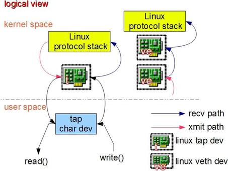

# 2.4 tun/tap

> 本文转自[wuyangchun](https://segmentfault.com/a/1190000009249039)

### 虚拟网络设备

Linux用户想要使用网络功能，不能直接通过操作硬件完成，而需要直接或间接的操作一个通过Linux网络设备管理层为我们抽象出来的设备，既通用的Linux网络设备来完成。一个常见的情况是，系统里装有一个硬件网卡，Linux会在系统里为其生成一个网络设备实例，如eth0，用户通过对eth0发出命令进而使用硬件设备。同时虚拟的网络设备（tun/tap）也会对应一个网络设备实例如tun0。

网络设备管理层处于网络设备驱动和协议栈之间，负责衔接它们之间的数据交互。驱动不需要了解协议栈的细节，协议栈也不需要了解设备驱动的细节。

对于一个网络设备来说，就像一个管道（pipe）一样，都有两端，从其中任意一端收到的数据将从另一端发送出去。

比如一个物理网卡eth0，它的两端分别是内核协议栈（通过内核网络设备管理模块间接的通信）和外面的物理网络，从物理网络收到的数据，会转发给内核协议栈，而应用程序从协议栈发过来的数据将会通过物理网络发送出去。

那么对于一个虚拟网络设备呢？首先它也归内核的网络设备管理子系统管理，对于Linux内核网络设备管理模块来说，虚拟设备和物理设备没有区别，都是网络设备，都能配置IP，从网络设备来的数据，都会转发给协议栈，协议栈过来的数据，也会交由网络设备发送出去，至于是怎么发送出去的，发到哪里去，那是设备驱动的事情，跟Linux内核就没关系了，所以说虚拟网络设备的一端也是协议栈，而另一端是什么取决于虚拟网络设备的驱动实现。

### tun/tap的另一端是什么？

先看图再说话：
```
+----------------------------------------------------------------+
|                                                                |
|  +--------------------+      +--------------------+            |
|  | User Application A |      | User Application B |<-----+     |
|  +--------------------+      +--------------------+      |     |
|               | 1                    | 5                 |     |
|...............|......................|...................|.....|
|               ↓                      ↓                   |     |
|         +----------+           +----------+              |     |
|         | socket A |           | socket B |              |     |
|         +----------+           +----------+              |     |
|                 | 2               | 6                    |     |
|.................|.................|......................|.....|
|                 ↓                 ↓                      |     |
|             +------------------------+                 4 |     |
|             | Newwork Protocol Stack |                   |     |
|             +------------------------+                   |     |
|                | 7                 | 3                   |     |
|................|...................|.....................|.....|
|                ↓                   ↓                     |     |
|        +----------------+    +----------------+          |     |
|        |      eth0      |    |      tun0      |          |     |
|        +----------------+    +----------------+          |     |
|    10.32.0.11  |                   |   192.168.3.11      |     |
|                | 8                 +---------------------+     |
|                |                                               |
+----------------|-----------------------------------------------+
                 ↓
         Physical Network
```

上图中有两个应用程序A和B，都在用户层，而其它的socket、协议栈（Newwork Protocol Stack）和网络设备（eth0和tun0）部分都在内核层，其实socket是协议栈的一部分，这里分开来的目的是为了看的更直观。

tun0是一个Tun/Tap虚拟设备，从上图中可以看出它和物理设备eth0的差别，它们的一端虽然都连着协议栈，但另一端不一样，eth0的另一端是物理网络，这个物理网络可能就是一个交换机，而tun0的另一端是一个用户层的程序，协议栈发给tun0的数据包能被这个应用程序读取到，并且应用程序能直接向tun0写数据。

这里假设eth0配置的IP是10.32.0.11，而tun0配置的IP是192.168.3.11.

> 这里列举的是一个典型的tun/tap设备的应用场景，发到192.168.3.0/24网络的数据通过程序B这个隧道，利用10.32.0.11发到远端网络的10.33.0.1，再由10.33.0.1转发给相应的设备，从而实现VPN。
下面来看看数据包的流程：

1. 应用程序A是一个普通的程序，通过socket A发送了一个数据包，假设这个数据包的目的IP地址是192.168.3.1
2. socket将这个数据包丢给协议栈
3. 协议栈根据数据包的目的IP地址，匹配本地路由规则，知道这个数据包应该由tun0出去，于是将数据包交给tun0
4. tun0收到数据包之后，发现另一端被进程B打开了，于是将数据包丢给了进程B
5. 进程B收到数据包之后，做一些跟业务相关的处理，然后构造一个新的数据包，将原来的数据包嵌入在新的数据包中，最后通过socket B将数据包转发出去，这时候新数据包的源地址变成了eth0的地址，而目的IP地址变成了一个其它的地址，比如是10.33.0.1.
6. socketB将数据包丢给协议栈
7. 协议栈根据本地路由，发现这个数据包应该要通过eth0发送出去，于是将数据包交给eth0
8. eth0通过物理网络将数据包发送出去

10.33.0.1收到数据包之后，会打开数据包，读取里面的原始数据包，并转发给本地的192.168.3.1，然后等收到192.168.3.1的应答后，再构造新的应答包，并将原始应答包封装在里面，再由原路径返回给应用程序B，应用程序B取出里面的原始应答包，最后返回给应用程序A

> 这里不讨论Tun/Tap设备tun0是怎么和用户层的进程B进行通信的，对于Linux内核来说，有很多种办法来让内核空间和用户空间的进程交换数据。
从上面的流程中可以看出，数据包选择走哪个网络设备完全由路由表控制，所以如果我们想让某些网络流量走应用程序B的转发流程，就需要配置路由表让这部分数据走tun0。

### tun/tap设备有什么用？

从上面介绍过的流程可以看出来，tun/tap设备的用处是将协议栈中的部分数据包转发给用户空间的应用程序，给用户空间的程序一个处理数据包的机会。于是比较常用的数据压缩，加密等功能就可以在应用程序B里面做进去，tun/tap设备最常用的场景是VPN，包括tunnel以及应用层的IPSec等，比较有名的项目是VTun，有兴趣可以去了解一下。

### tun和tap的区别

用户层程序通过tun设备只能读写IP数据包，而通过tap设备能读写链路层数据包，类似于普通socket和raw socket的差别一样，处理数据包的格式不一样。

### 示例

#### 示例程序

这里写了一个程序，它收到tun设备的数据包之后，只打印出收到了多少字节的数据包，其它的什么都不做，如何编程请参考后面的参考链接。

```c
#include <net/if.h>
#include <sys/ioctl.h>
#include <sys/stat.h>
#include <fcntl.h>
#include <string.h>
#include <sys/types.h>
#include <linux/if_tun.h>
#include<stdlib.h>
#include<stdio.h>

int tun_alloc(int flags)
{

    struct ifreq ifr;
    int fd, err;
    char *clonedev = "/dev/net/tun";

    if ((fd = open(clonedev, O_RDWR)) < 0) {
        return fd;
    }

    memset(&ifr, 0, sizeof(ifr));
    ifr.ifr_flags = flags;

    if ((err = ioctl(fd, TUNSETIFF, (void *) &ifr)) < 0) {
        close(fd);
        return err;
    }

    printf("Open tun/tap device: %s for reading...\n", ifr.ifr_name);

    return fd;
}

int main()
{

    int tun_fd, nread;
    char buffer[1500];

    /* Flags: IFF_TUN   - TUN device (no Ethernet headers)
     *        IFF_TAP   - TAP device
     *        IFF_NO_PI - Do not provide packet information
     */
    tun_fd = tun_alloc(IFF_TUN | IFF_NO_PI);

    if (tun_fd < 0) {
        perror("Allocating interface");
        exit(1);
    }

    while (1) {
        nread = read(tun_fd, buffer, sizeof(buffer));
        if (nread < 0) {
            perror("Reading from interface");
            close(tun_fd);
            exit(1);
        }

        printf("Read %d bytes from tun/tap device\n", nread);
    }
    return 0;
}
```

#### 演示

```bash
#--------------------------第一个shell窗口----------------------
#将上面的程序保存成tun.c，然后编译
dev@debian:~$ gcc tun.c -o tun

#启动tun程序，程序会创建一个新的tun设备，
#程序会阻塞在这里，等着数据包过来
dev@debian:~$ sudo ./tun
Open tun/tap device tun1 for reading...
Read 84 bytes from tun/tap device
Read 84 bytes from tun/tap device
Read 84 bytes from tun/tap device
Read 84 bytes from tun/tap device

#--------------------------第二个shell窗口----------------------
#启动抓包程序，抓经过tun1的包
# tcpdump -i tun1
tcpdump: verbose output suppressed, use -v or -vv for full protocol decode
listening on tun1, link-type RAW (Raw IP), capture size 262144 bytes
19:57:13.473101 IP 192.168.3.11 > 192.168.3.12: ICMP echo request, id 24028, seq 1, length 64
19:57:14.480362 IP 192.168.3.11 > 192.168.3.12: ICMP echo request, id 24028, seq 2, length 64
19:57:15.488246 IP 192.168.3.11 > 192.168.3.12: ICMP echo request, id 24028, seq 3, length 64
19:57:16.496241 IP 192.168.3.11 > 192.168.3.12: ICMP echo request, id 24028, seq 4, length 64

#--------------------------第三个shell窗口----------------------
#./tun启动之后，通过ip link命令就会发现系统多了一个tun设备，
#在我的测试环境中，多出来的设备名称叫tun1，在你的环境中可能叫tun0
#新的设备没有ip，我们先给tun1配上IP地址
dev@debian:~$ sudo ip addr add 192.168.3.11/24 dev tun1

#默认情况下，tun1没有起来，用下面的命令将tun1启动起来
dev@debian:~$ sudo ip link set tun1 up

#尝试ping一下192.168.3.0/24网段的IP，
#根据默认路由，该数据包会走tun1设备，
#由于我们的程序中收到数据包后，啥都没干，相当于把数据包丢弃了，
#所以这里的ping根本收不到返回包，
#但在前两个窗口中可以看到这里发出去的四个icmp echo请求包，
#说明数据包正确的发送到了应用程序里面，只是应用程序没有处理该包
dev@debian:~$ ping -c 4 192.168.3.12
PING 192.168.3.12 (192.168.3.12) 56(84) bytes of data.

--- 192.168.3.12 ping statistics ---
4 packets transmitted, 0 received, 100% packet loss, time 3023ms
```

### 小结



当一个Tun/Tap设备被创建时，在 Linux设备文件目录下将会生成一个对应char设备，用户程序可以像打开普通文件一样打开这个文件进行读写。当执行write()操作时，数据进入Tun/Tap设备，此时对于Linux网络层来说，相当于Tun/Tap设备收到了一包数据，请求内核接受它，如同普通的物理网卡从外界收到一包数据一样，不同的是其实数据来自Linux上的一个用户程序。Linux 收到此数据后将根据网络配置进行后续处理，从而完成了用户程序向Linux内核网络层注入数据的功能。当用户程序执行 read()请求时，相当于向内核查询Tun/Tap设备上是否有需要被发送出去的数据，有的话取出到用户程序里，完成Tun/Tap设备的发送数据功能。针对Tun/Tap设备的一个形象的比喻是：使用 Tun/Tap设备的应用程序相当于另外一台计算机，Tun/Tap设备是本机的一个网卡，他们之间相互连接。应用程序通过read()/write()操作，和本机网络核心进行通讯。

Tun/Tap都是虚拟网卡，没有直接映射到物理网卡，是一种纯软件的实现。Tun是三层虚拟设备，能够处理三层即IP包，Tap是二层设备，能处理链路层网络包如以太网包。使用虚拟网络设备，常用于实现隧道以及平时网络调试。

### 参考文档

* [1] https://www.kernel.org/doc/Documentation/networking/tuntap.txt
* [2] http://backreference.org/2010/03/26/tuntap-interface-tutorial/
* [3] https://www.ibm.com/developerworks/cn/linux/1310_xiawc_networkdevice/index.html